# Hi, I’m missing-user! 👋

A **physics student** and **software developer** from Germany. I love building simulations, games and electronics projects - especially anything visual and interactive!

## You can find most of my current projects on [jurasic.dev](https://jurasic.dev/)

<!-- transparent stat banner, full width-->

<!--
Stats banner using the gradient from my website

-->
